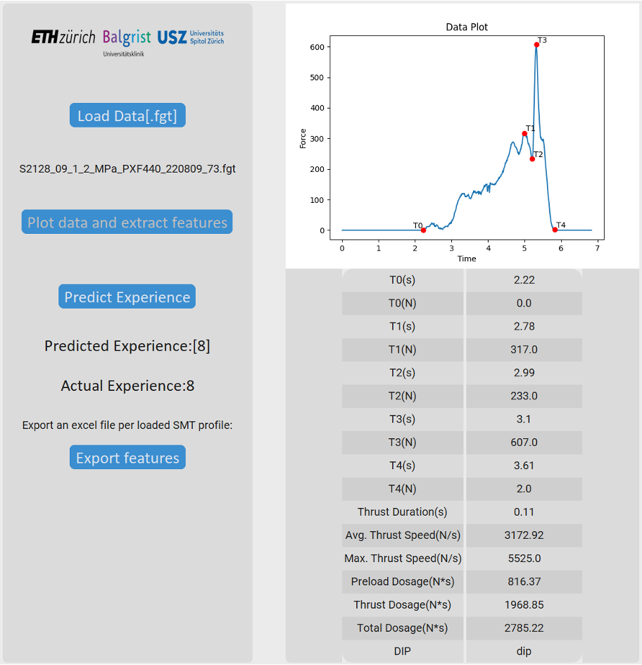

This is the Gitub page for the CAP2 GUI.
The GUI can be downloaded here: 
https://polybox.ethz.ch/index.php/s/ZkSnNEPzaTjphUp

To run the GUI follow this path:
CAP2/GUI/CAP2.exe

The Gui looks like this:

It has several different Functions:

Load Data:

With this button, the user can load a .fgt file, which contains the sensor data.

Plot Data:

The Plot Data button, creates a window which plots the force time profile and annotates it with the timesteps T0 to T4. Additionaly the software extracts the features of the force time profile and displays them in a table.

Predict experience:

When pressed, this button loads the finished model, based on the xgb classifier, and predicts the experi- ence of the practitioner, who performed the intervention.

Export features:

This button allows the user to export the features as a .xlsx file.

